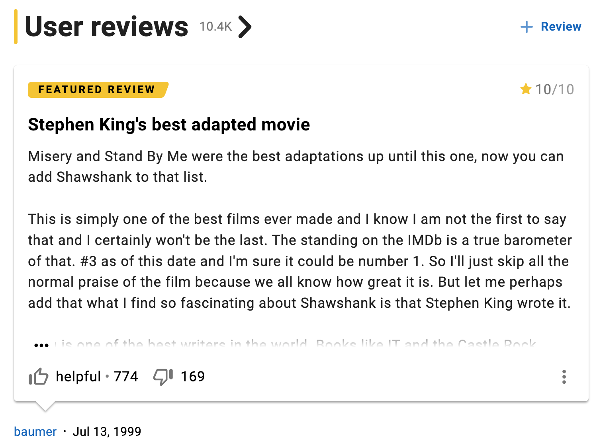

# Final Course Project – IMDB Reviews Classification (Group Project)

The final course project (FCP) consists of a text classification task: you’re supposed to adjudicate between helpful and unhelpful movie reviews from the IMDB database.
For the sake of redundancy, your goal is to classify each movie review “i” into one of the two categories:
0/not helpful: less than 30% of IMDB users found movie review “i” helpful 
1/helpful: more than 70% of IMDB users found movie review “i” helpful 
# Data and file description
The training data (train.csv, see the download area below) contains 10,755 labelled reviews. The test data contains 5,071 reviews that are unlabeled (test.csv, see below). All the reviews included in the dataset have at least 80 votes. The dataset for this  FCP focuses on the left- and right-hand ‘tails’ of the distribution.
